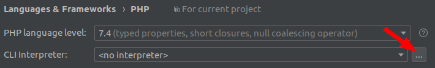
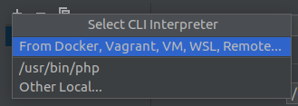
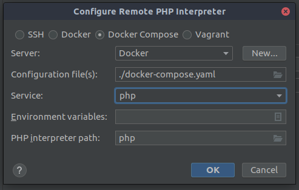
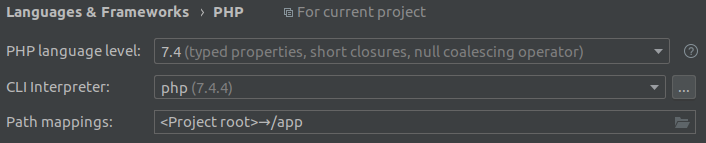
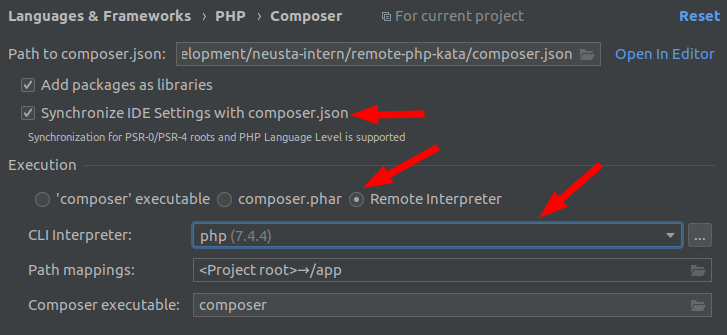
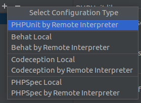
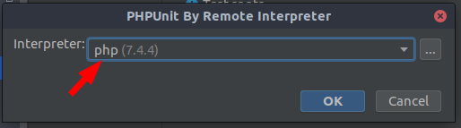

# Remote PHP Kata

Update 10.12.2020:

The main branch is PHP 8.0 now. There is a legacy 7.4 branch and tag, if you need/want to works with php 7.4.

## Requirements

* git
* docker
* (Windows) Share Docker Daemon via TCP (Docker for Windows Settings -> General)
* PhpStorm with working Docker connection configured.
* some remote screensharing tool, e.g. meet.jit.si or similar.

## Installation

* `git clone https://gitlab.neusta.de/nsd-intern/remote-php-kata.git`
* `docker-compose build`
* `docker-compose run php composer install`
* Open project in PhpStorm

## PhpStorm Setup

* File | Settings | Languages & Frameworks | PHP -> Add Docker-Compose interpreter
  
  
  
  * Click the tiny `+` in the upper left and select "From Docker, vagrant, VM..."
  
    
    
  * Choose "Docker Compose" and choose the following settings:
    
    
    
* File | Settings | Languages & Frameworks | PHP should look like this:
  
  
  
* File | Settings | Languages & Frameworks | PHP | Composer -> Configure Composer  
  * Enable Composer Settings Sync
  * Choose Composer by Remote Interpreter
  * Choose your Docker-Compose interpreter you've just configured.
  
  
  
* File | Settings | Languages & Frameworks | PHP | Test Frameworks -> Setup PhpUnit Integration
  * Click the tiny `+` in the upper left and select "PHPUnit by Remote Interpreter"
    
    

  * Choose your Docker-Compose interpreter you've just configured.
    
    
  
  * After a moment the screen should look like this, automatically:
    
    
  
* Right click [phpunit.xml](./phpunit.xml) in the Project Browser and select "Run 'phpunit.xml (PHPUnit)'", and you're good to go! 
  
## Workflow

Following [Remote Mob Programming](https://www.remotemobprogramming.org/#git-handover):

1. Meet online. Everyone activates his/her camera.
2. First coder shares his/her screen/IDE and creates a kata branch: `git checkout -b kata`
3. Write your first failing test
4. Add and commit changes to the `kata` branch, push the branch to the repository.
5. Everyone in PhpStorm: `Ctrl + T` (Update project/git fetch) and switch to the `kata` branch.
6. First coder stops sharing his/her screen, second coder shares his/her screen/IDE.
7. Second coder makes the red test pass and writes a new red test.
8. Second coder commits and pushes his/her changes to the `kata` branch. 
   * PhpStorm: `Ctrl + K`, Commit message doesn't matter, Submit dialog with `Ctrl + Alt + K` (Commit & Push)
9. \[\[ Repeat step 2-6 until done \]\]
10. Delete the local and remote `kata` branch: `git branch -D kata` and `git branch -D origin/kata`.

## No PhpStorm, No Problem!

You can run tests directly via docker-compose: `docker-compose run php vendor/bin/phpunit`
